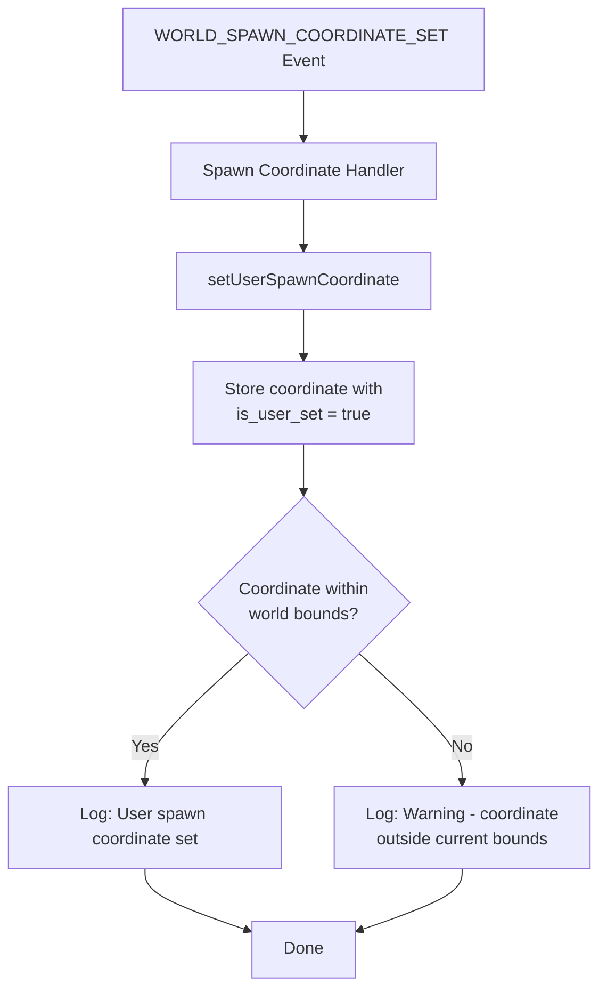
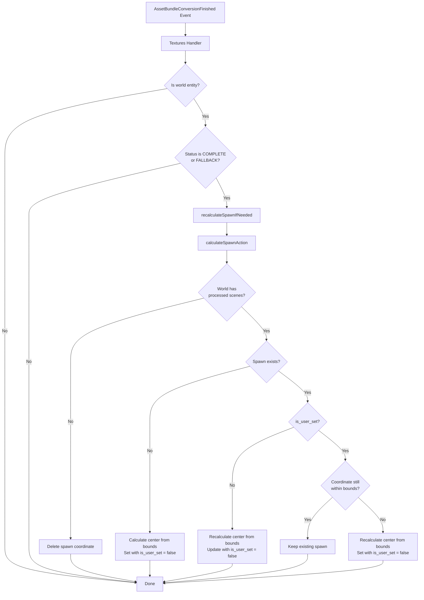
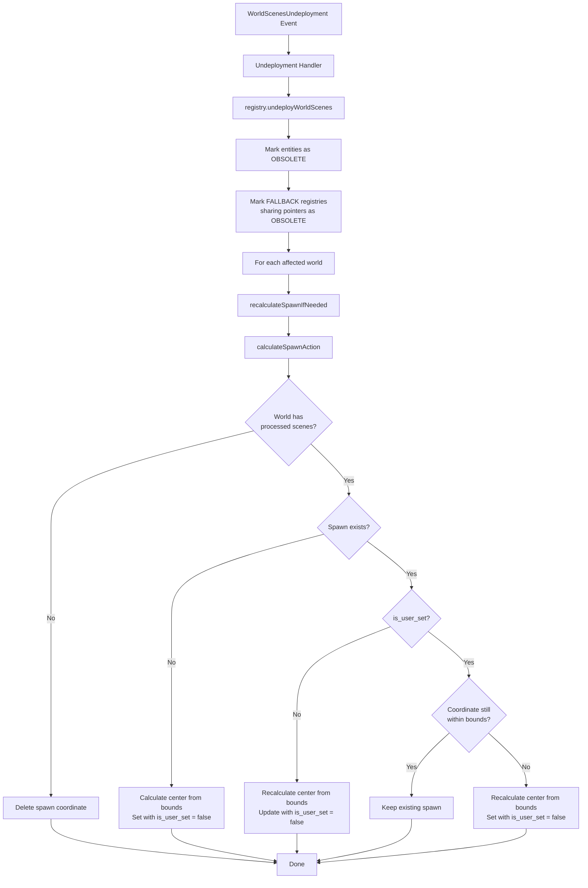
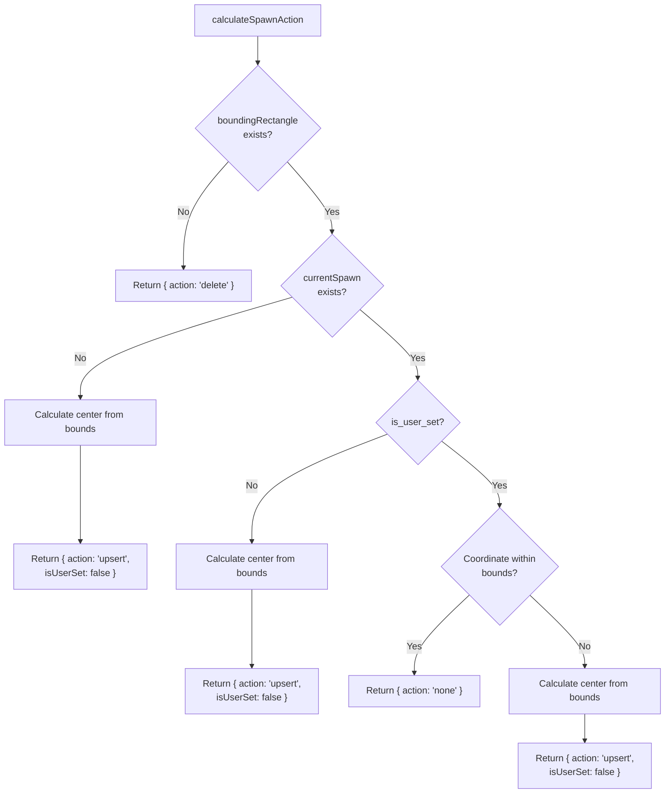

# World Manifest Support & Spawn Coordinate Handling

## Summary

This PR adds world manifest support and intelligent spawn coordinate management to the asset-bundle-registry:

- **New endpoint** `GET /worlds/:world-name/manifest` returning occupied parcels and spawn coordinates
- **Spawn coordinate event handling** for `WORLD_SPAWN_COORDINATE_SET` events
- **Automatic spawn coordinate recalculation** when world scenes are deployed or undeployed

## New Features

### World Manifest Endpoint

A new endpoint to retrieve the world manifest:

```
GET /worlds/:world-name/manifest
```

Response schema:

```json
{
  "occupied": ["0,0", "0,1", "1,0", "1,1"],
  "spawn_coordinate": { "x": "0", "y": "0" },
  "total": 4
}
```

- `occupied`: Array of parcels in "x,y" format from processed scenes (COMPLETE or FALLBACK status)
- `spawn_coordinate`: The spawn coordinate (user-set or auto-calculated center)
- `total`: Total number of occupied parcels

### Spawn Coordinate Event Handling

Handles `WorldSpawnCoordinateSetEvent` events to allow users to explicitly set spawn coordinates for their worlds. User-set coordinates are preserved as long as they remain valid for the world shape.

### Automatic Spawn Coordinate Management

The system intelligently manages spawn coordinates:

- **On scene processing** (textures handler): Recalculates spawn if needed when a scene becomes COMPLETE or FALLBACK
- **On undeployment**: Recalculates spawn if needed when scenes are removed from a world
- **User-set coordinates**: Preserved when still valid for the world shape; recalculated when invalid

## Architecture

### New `coordinates` Component

```
src/logic/coordinates/
├── index.ts        # Exports
├── component.ts    # Main component with all logic and utility functions
└── types.ts        # Component-specific types
```

The component provides:

- `recalculateSpawnIfNeeded(worldName)` - Intelligently updates spawn after shape changes
- `setUserSpawnCoordinate(worldName, coordinate)` - Sets user-specified spawn
- `getWorldManifest(worldName)` - Returns the world manifest

Utility functions (exported for reuse):

- `parseCoordinate(coord)` - Parse "x,y" string to {x, y} object
- `formatCoordinate(coord)` - Format {x, y} to "x,y" string
- `calculateCenter(parcels)` - Calculate geometric center of parcels
- `isCoordinateInParcels(coord, parcels)` - Check if coordinate is valid

### Database Changes

New table `world_spawn_coordinates`:

```sql
CREATE TABLE world_spawn_coordinates (
  world_name VARCHAR(255) PRIMARY KEY,
  x INTEGER NOT NULL,
  y INTEGER NOT NULL,
  is_user_set BOOLEAN NOT NULL DEFAULT FALSE,
  timestamp BIGINT NOT NULL
);
```

The `is_user_set` flag distinguishes between:

- User-explicitly-set coordinates (preserved when valid)
- Auto-calculated coordinates (freely recalculated)

New database methods in `db.ts`:

- `getSpawnCoordinate(worldName)`
- `upsertSpawnCoordinate(worldName, x, y, isUserSet)`
- `deleteSpawnCoordinate(worldName)`
- `getProcessedWorldParcels(worldName)`
- `getRegistriesByIds(entityIds)`

## Important: "Processed" vs "Pending" Scenes

Only **processed** scenes (COMPLETE or FALLBACK status) are included in the world shape:

- **COMPLETE**: Assets fully converted, no newer entity being processed
- **FALLBACK**: Assets fully converted, but a newer PENDING entity exists

This ensures the world shape reflects only scenes that have been fully processed and can be served to users.

## Migration Notes

The migration (`1769300000000_world-spawn-coordinates.ts`):

1. Creates the `world_spawn_coordinates` table
2. Populates default spawn coordinates for all existing worlds using:
   - `metadata.scene.base` as the primary source
   - First parcel in `pointers` as fallback
   - Only processes COMPLETE/FALLBACK registries

## Files Changed

### New Files

- `src/migrations/1769300000000_world-spawn-coordinates.ts`
- `src/logic/coordinates/index.ts`
- `src/logic/coordinates/component.ts`
- `src/logic/coordinates/types.ts`
- `src/logic/handlers/spawn-coordinate-handler.ts`
- `src/controllers/handlers/get-world-manifest.ts`
- `test/unit/logic/coordinates/component.spec.ts`
- `test/unit/logic/handlers/spawn-coordinate-handler.spec.ts`
- `test/unit/mocks/coordinates.ts`

### Modified Files

- `src/adapters/db.ts` - Added spawn coordinate methods
- `src/types/service.ts` - Added interfaces
- `src/types/system.ts` - Added coordinates to BaseComponents
- `src/types/types.ts` - Added SPAWN_COORDINATE event handler name
- `src/controllers/routes.ts` - Added manifest endpoint route
- `src/logic/message-processor.ts` - Added spawn coordinate handler
- `src/logic/handlers/textures-handler.ts` - Trigger spawn recalculation
- `src/logic/handlers/undeployment-handler.ts` - Trigger spawn recalculation
- `src/components.ts` - Created coordinates component
- `test/unit/mocks/db.ts` - Added mock methods
- `test/unit/logic/handlers/undeployment-handler.spec.ts` - Updated tests

## Testing

Unit tests cover:

- Coordinate utility functions (parsing, formatting, center calculation, containment)
- Coordinates component behavior (recalculation logic, user-set preservation)
- Spawn coordinate event handler
- Updated undeployment handler with coordinates integration

Run tests:

```bash
npm test -- --testPathPattern="spawn-coordinate-handler|coordinates/component|undeployment-handler"
```

## Spawn Coordinate Change Flowcharts

### 1. User Sets Spawn Coordinate (`WORLD_SPAWN_COORDINATE_SET` Event)



### 2. Scene Processing Completes (Textures Handler)



### 3. Scene Undeployment (Undeployment Handler)



### Core Decision Logic (`calculateSpawnAction`)



## How to Verify

1. **Manifest endpoint**: Call `GET /worlds/:world-name/manifest` for an existing world
2. **Spawn coordinate event**: Send a `WORLD_SPAWN_COORDINATE_SET` event and verify the coordinate is stored
3. **Auto-recalculation**: Deploy/undeploy a world scene and verify spawn coordinates are recalculated appropriately
