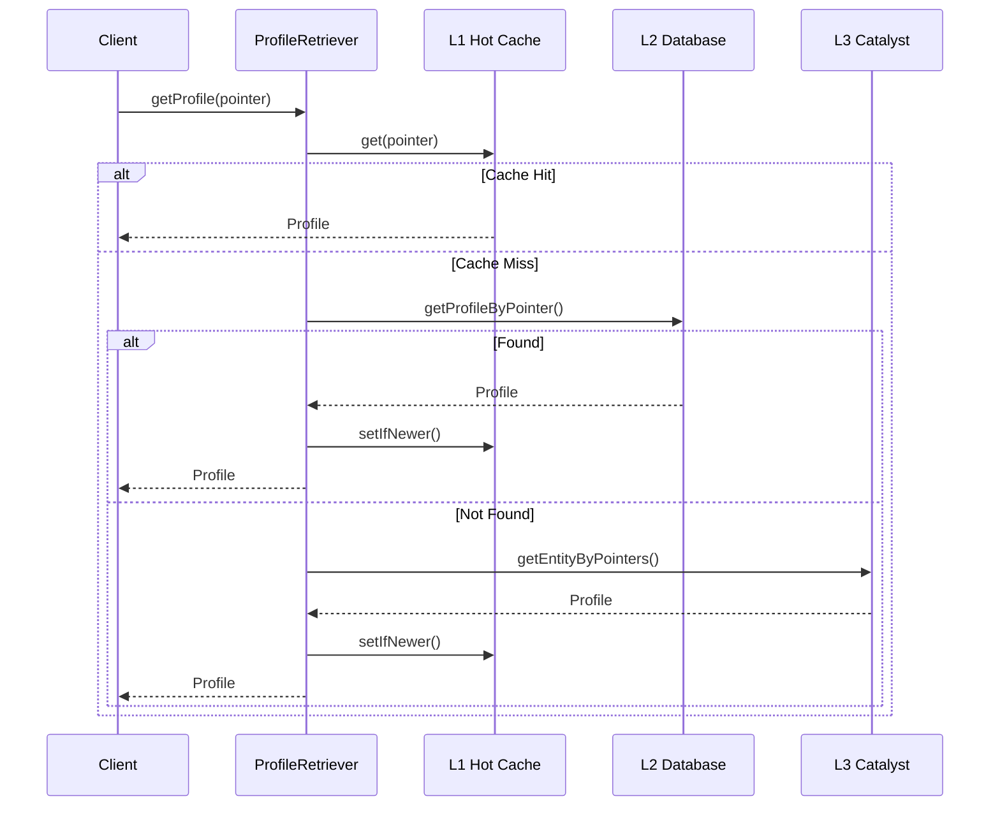

# Asset Bundle Registry

A service for orchestrating the availability of Asset Bundles and LODs.

## Description

The Asset Bundle Registry acts as a gateway, enabling clients to retrieve the available Asset Bundles and LODs for each deployed scene on the Decentraland network. It ensures that optimized textures are always available for a given set of pointers, improving user experience and preventing empty scenes to be seen in-world.

This service integrates with our event-driven architecture, monitoring deployments of Catalyst entities that require optimization before rendering in the reference client. The optimization process is handled by the [Asset Bundle Converter](https://github.com/decentraland/asset-bundle-converter) and [LODs Generator](https://github.com/decentraland/lods-generator).

## Workflow

1. **Entity Deployment**: An entity requiring optimization before client-side rendering is deployed to a Catalyst.
2. **Forwarding Events**: The [Deployments-to-SQS](https://github.com/decentraland/deployments-to-sqs) service forwards the deployment to the event-driven architecture using SNS as a bridge.
3. **Marking for Optimization**: 
   - This service listens to deployment events (via SQS) and marks the entity as `pending` for optimization.
   - Simultaneously, the Asset Bundle Converter and LODs Generator receive the deployment in their respective queues for processing.
4. **Optimization Completion**: 
   - Once the Asset Bundle Converter completes optimization, it publishes an `AssetBundleConversionFinished` event to the event-driven architecture. ([See event schema](https://github.com/decentraland/schemas/blob/main/src/platform/events/services.ts)).
5. **State Transition**: 
   - The Registry listens for `AssetBundleConversionFinished` events. 
   - Upon receiving confirmation that an entity has been optimized and is ready for client retrieval, the service updates the deployment state from `pending` to `complete`.
6. **Client Requests**: 
   - When a client requests textures for a scene, emote, or wearable, the Registry queries its database for the most recent optimized texture and serves it to the client.

## Transition to optimized state criteria

This criteria can evolve and change over time. As of the time of writing, this Registry marks an entity as ready to be retrieved when it receives confirmation that the deployed entity has been optimized for Windows and Mac platforms. At the moment, LODs are not being considered for this state transition.

## Profile Synchronization

Centralized reactive cache for fetching user profiles with high availability and low latency.

### Sync Phases

1. **Bootstrap**: Initial data load using snapshots (large gaps) or pointer-changes (small gaps)
2. **Incremental**: Continuous near real-time (1s) sync via Catalyst pointer-changes endpoint

### Cache Architecture

```
L1 Hot Cache (LRU) → L2 Database → L3 Catalyst
```

- **L1**: In-memory LRU, instant access, timestamp-validated
- **L2**: PostgreSQL, persistent storage
- **L3**: Catalyst fallback for cache misses

### Components

| Component | Purpose |
|-----------|---------|
| `synchronizer` | Orchestrates bootstrap and incremental sync phases |
| `entity-tracker` | Deduplication (LRU) + permanent tracking (Bloom filter) |
| `entity-persistent` | Persists to in-memory cache and database |
| `hot-profiles-cache` | L1 in-memory cache with timestamp validation |
| `profile-retriever` | Multi-layer cache lookup with batch operations |

### Retrieval Flow



## Endpoints

### GET /status
Returns the service status, version, and commit hash information.

**Response:**
```json
{
  "data": {
    "version": "1.0.0",
    "currentTime": 1648744800000,
    "commitHash": "abc123"
  }
}
```

### GET /entities/status/:id
Returns the optimization status for a specific entity. Requires authentication. Only returns data if the requesting user is the entity deployer.

**Response:**
```json
{
  "catalyst": "complete",
  "complete": true,
  "assetBundles": {
    "mac": "complete",
    "windows": "complete"
  },
  "lods": {
    "mac": "complete",
    "windows": "complete"
  }
}
```

**Status Values:**
- `pending`: Asset is queued for optimization
- `complete`: Asset has been successfully optimized
- `failed`: Asset optimization failed

### GET /entities/status
Returns the optimization status for all entities owned by the authenticated user.

**Response:**
```json
[
  {
    "catalyst": "complete",
    "complete": true,
    "assetBundles": {
      "mac": "complete",
      "windows": "complete"
    },
    "lods": {
      "mac": "complete",
      "windows": "complete"
    }
  }
  // ... more entities
]
```

### POST /registry
Admin endpoint for registering new entities for optimization. Requires authentication using `API_ADMIN_TOKEN` environment variable.

**Request Body:**
```json
{
  "entityIds": ["bafkreig..."]
}
```

**Response:**
```json
{
  "failures": [
    {
      "entityId": "bafkreig...",
      "error": "Error message"
    }
  ],
  "successes": [
    "bafkreig..."
  ]
}
```

## Set-up

### Environment Variables

Required environment variables:

- `PG_COMPONENT_PSQL_CONNECTION_STRING` or individual PostgreSQL connection variables:
  - `PG_COMPONENT_PSQL_USER`
  - `PG_COMPONENT_PSQL_DATABASE`
  - `PG_COMPONENT_PSQL_PORT`
  - `PG_COMPONENT_PSQL_HOST`
  - `PG_COMPONENT_PSQL_PASSWORD`
- `CATALYST_LOADBALANCER_HOST`
- `ASSET_BUNDLE_CDN_URL`
- `AWS_SNS_ARN`
- `AWS_SNS_ENDPOINT`
- `AWS_SQS_ENDPOINT`

### Database through docker-compose

To start a new, fresh database, run the following command:

`docker-compose up`

## Scripts

The `/src/scripts` directory contains utility scripts for populating the Asset Bundle Registry with entities. These scripts run locally but interact with remote Asset Bundle Registry instances.

Available scripts:
- `yarn scripts:populate-items <csv_file_path>`: Process wearables/emotes from a CSV file
  - Automatically generates `{filename}-failures.csv` for any failed entities
  - The failures file maintains the same CSV format as the input
  - To retry failed entities, run the script again with the failures file:
    ```bash
    # First attempt with original file
    yarn scripts:populate-items wearables.csv
    # Retry any failures
    yarn scripts:populate-items wearables-failures.csv
    ```
- `yarn scripts:populate-scenes`: Process scenes from World Manifest

For detailed information about script usage, environment variables, and file formats, see [Scripts Documentation](src/scripts/README.md).

## Development

### Environment Variables

Copy `.env.default` to `.env` and set the required variables:

```bash
cp .env.default .env
```

### Install

```bash
yarn
```

### Build

```bash
yarn build
```

### Start

```bash
yarn start
```

### Test

```bash
yarn test
```

## AI Agent Context

For detailed AI Agent context, see [docs/ai-agent-context.md](docs/ai-agent-context.md).