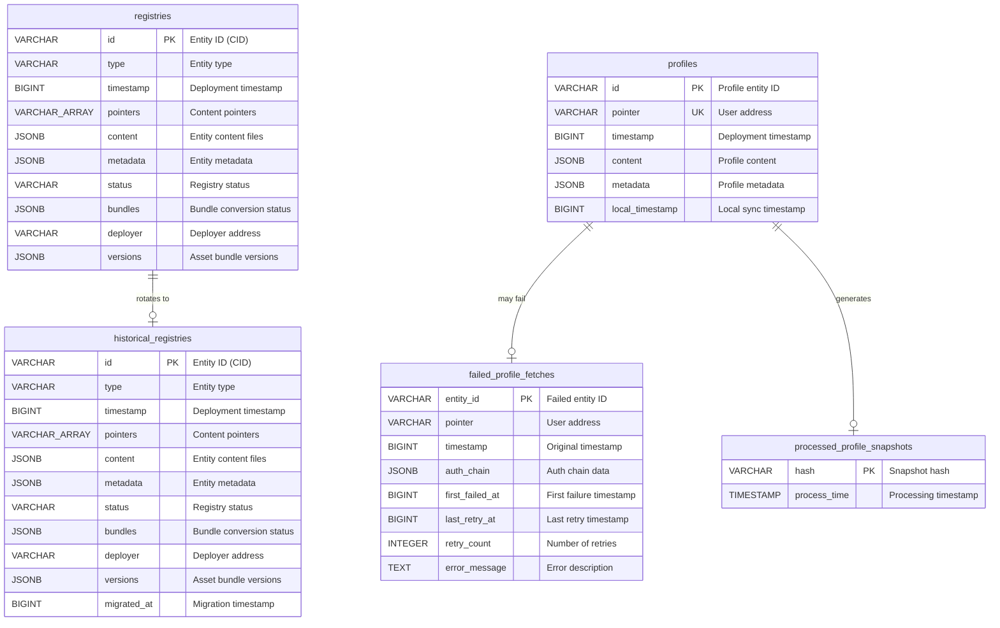

# Database Schema Documentation

This document describes the database schema for the Asset Bundle Registry service. The schema uses PostgreSQL and is managed through migrations located in `src/migrations/`.

## Database Schema Diagram



## Tables Overview

The database contains the following tables:

1. **`registries`** - Stores active entity registrations with their bundle conversion status
2. **`historical_registries`** - Archives previous entity versions when new deployments occur
3. **`profiles`** - Caches validated user profiles from Catalyst servers
4. **`processed_profile_snapshots`** - Tracks which profile snapshots have been processed
5. **`failed_profile_fetches`** - Stores failed profile fetch attempts for retry

---

## Table: `registries`

Stores active entity registrations including scenes, wearables, emotes, and worlds with their asset bundle conversion status.

### Columns

| Column | Type | Nullable | Description |
|--------|------|----------|-------------|
| `id` | VARCHAR(255) | NOT NULL | **Primary Key**. Entity content identifier (CID) from Catalyst. |
| `type` | VARCHAR(255) | NOT NULL | Entity type: `scene`, `wearable`, `emote`, `profile`, or `world`. |
| `timestamp` | BIGINT | NOT NULL | Unix timestamp (milliseconds) when the entity was deployed to Catalyst. |
| `pointers` | VARCHAR(255)[] | NOT NULL | Array of pointers where this entity is active (coordinates or URNs). |
| `content` | JSONB | NOT NULL | Entity content files with file paths and content hashes. |
| `metadata` | JSONB | NULL | Entity-specific metadata (varies by entity type). |
| `status` | VARCHAR(255) | NOT NULL | Registry status: `complete`, `pending`, `failed`, `obsolete`, or `fallback`. |
| `bundles` | JSONB | NOT NULL | Asset bundle and LOD conversion status per platform (Windows, Mac, WebGL). |
| `deployer` | VARCHAR(255) | NOT NULL | Ethereum address of the entity deployer. |
| `versions` | JSONB | NULL | Asset bundle version information per platform (version string, build date). |

### Indexes

- **Primary Key**: `id`
- **GIN Index**: `pointers` - For efficient array containment queries
- **Index**: `status` - For filtering by conversion status
- **Index**: `timestamp` - For ordering by deployment time
- **Index**: `deployer` - For querying entities by owner
- **Index**: `registries_id_lower_idx` on `LOWER(id)` - Case-insensitive entity ID lookups

### JSONB Structure: `bundles`

```json
{
  "assets": {
    "windows": "complete|pending|failed",
    "mac": "complete|pending|failed",
    "webgl": "complete|pending|failed"
  },
  "lods": {
    "windows": "complete|pending|failed",
    "mac": "complete|pending|failed",
    "webgl": "complete|pending|failed"
  }
}
```

### JSONB Structure: `versions`

```json
{
  "assets": {
    "windows": { "version": "v5", "buildDate": "2024-01-15" },
    "mac": { "version": "v5", "buildDate": "2024-01-15" },
    "webgl": { "version": "v5", "buildDate": "2024-01-15" }
  }
}
```

### Business Rules

1. Entity ID is the content identifier (CID) from Catalyst
2. Status transitions: `pending` → `complete` (on successful conversion) or `failed` (on error)
3. When a new entity is deployed to the same pointer, the old entity becomes `obsolete` or `fallback`
4. The `fallback` status indicates the entity is served while newer content is being processed
5. Timestamps stored in milliseconds (BIGINT)

---

## Table: `historical_registries`

Archives previous entity versions when new deployments occur. Used for audit trails and analytics.

### Columns

| Column | Type | Nullable | Description |
|--------|------|----------|-------------|
| `id` | VARCHAR(255) | NOT NULL | **Primary Key**. Entity content identifier (CID). |
| `type` | VARCHAR(255) | NOT NULL | Entity type: `scene`, `wearable`, `emote`, `profile`, or `world`. |
| `timestamp` | BIGINT | NOT NULL | Unix timestamp (milliseconds) when the entity was deployed. |
| `pointers` | VARCHAR(255)[] | NOT NULL | Array of pointers where this entity was active. |
| `content` | JSONB | NOT NULL | Entity content files. |
| `metadata` | JSONB | NULL | Entity-specific metadata. |
| `status` | VARCHAR(255) | NOT NULL | Final status before archival. |
| `bundles` | JSONB | NOT NULL | Final bundle conversion status. |
| `deployer` | VARCHAR(255) | NOT NULL | Ethereum address of the entity deployer. |
| `versions` | JSONB | NULL | Asset bundle version information. |
| `migrated_at` | BIGINT | NOT NULL | Unix timestamp (milliseconds) when the entity was moved to historical. |

### Indexes

- **Primary Key**: `id`
- **Index**: `deployer` - For querying historical entities by owner
- **GIN Index**: `pointers` - For efficient array containment queries

### Business Rules

1. Entities are moved here when replaced by new deployments
2. The `migrated_at` timestamp records when the rotation occurred
3. Historical records are immutable after creation

---

## Table: `profiles`

Caches validated user profiles fetched from Catalyst servers for fast retrieval.

### Columns

| Column | Type | Nullable | Description |
|--------|------|----------|-------------|
| `id` | VARCHAR(255) | NOT NULL | **Primary Key**. Profile entity content identifier (CID). |
| `pointer` | VARCHAR(255) | NOT NULL | **Unique**. Ethereum address of the profile owner (lowercase). |
| `timestamp` | BIGINT | NOT NULL | Unix timestamp (milliseconds) from Catalyst deployment. |
| `content` | JSONB | NOT NULL | Profile content files (avatar images, etc.). |
| `metadata` | JSONB | NOT NULL | Profile metadata including avatar configuration. |
| `local_timestamp` | BIGINT | NOT NULL | Unix timestamp (milliseconds) when profile was cached locally. |

### Indexes

- **Primary Key**: `id`
- **Unique Constraint**: `pointer` - One profile per Ethereum address
- **Index**: `idx_profiles_timestamp` on `timestamp` - For ordering by deployment time
- **Index**: `idx_profiles_local_timestamp` on `local_timestamp` - For cache freshness queries

### Business Rules

1. Each Ethereum address has exactly one active profile
2. Profiles are periodically validated for ownership (curation job)
3. `local_timestamp` tracks when the profile was synced to this service
4. Profile metadata follows the Decentraland Profile schema

---

## Table: `processed_profile_snapshots`

Tracks which Catalyst profile snapshots have been processed to avoid reprocessing.

### Columns

| Column | Type | Nullable | Description |
|--------|------|----------|-------------|
| `hash` | VARCHAR(255) | NOT NULL | **Primary Key**. Snapshot content hash. |
| `process_time` | TIMESTAMP | NOT NULL | When the snapshot was processed. |

### Indexes

- **Primary Key**: `hash`

### Business Rules

1. Used to deduplicate snapshot processing during profile sync
2. Prevents reprocessing the same Catalyst snapshot multiple times

---

## Table: `failed_profile_fetches`

Stores failed profile fetch attempts for retry processing.

### Columns

| Column | Type | Nullable | Description |
|--------|------|----------|-------------|
| `entity_id` | VARCHAR(255) | NOT NULL | **Primary Key**. Profile entity ID that failed to fetch. |
| `pointer` | VARCHAR(255) | NOT NULL | Ethereum address of the profile. |
| `timestamp` | BIGINT | NOT NULL | Original deployment timestamp from the event. |
| `auth_chain` | JSONB | NULL | Authentication chain data (if available). |
| `first_failed_at` | BIGINT | NOT NULL | Unix timestamp (milliseconds) of first failure. |
| `last_retry_at` | BIGINT | NULL | Unix timestamp (milliseconds) of last retry attempt. |
| `retry_count` | INTEGER | NOT NULL | Number of retry attempts. Defaults to `0`. |
| `error_message` | TEXT | NULL | Error description from the last failure. |

### Indexes

- **Primary Key**: `entity_id`
- **Index**: `idx_failed_fetches_pointer` on `LOWER(pointer)` - Case-insensitive address lookup
- **Index**: `idx_failed_fetches_entity_id` on `LOWER(entity_id)` - Case-insensitive entity lookup
- **Index**: `idx_failed_fetches_retry_count` on `retry_count` - For retry prioritization

### Business Rules

1. Failed fetches are retried with exponential backoff
2. The `retry_count` determines retry priority and backoff delay
3. Successful retries remove the record from this table
4. Records with high retry counts may require manual intervention

---

## Related Code

- **Migrations**: `src/migrations/`
- **Database Adapters**: `src/adapters/db/`
- **Types**: `src/types/`
